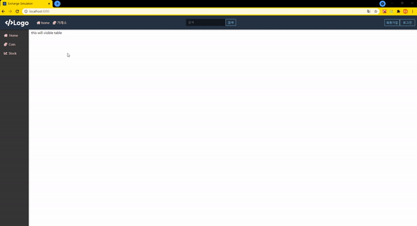

# 토이프로젝트 - 가상화폐 거래소 토이 프로잭트 (prototype)

bolier Plate Code : https://github.com/KMJ192/BolierPlateCode_1

### Client
- dev stack
  - typescript
  - React
  - Redux
    + thunk
    + saga
  - scss
  - styled-components
  - web socket(업비트 open api)

### Server
- dev stack
  - typescript
  - nest.js
  - mysql

### Todo List
- front-end
  - candle데이터 한번에 최대 200개 받아올 수 있으므로 request parameter에 스크롤 움직임에 따른 시간 계산 로직 추가
  - 호가창 구현
  - 실시간 체결창 구현
  - 모의투자 구현
  - upbit에서 받아온 데이터 시각화
    + light-weight chart 사용
- back-end
  - . . .

### 완료된 작업
- front-end
  - upbit open api 모듈화(redux, redux-thunk, redux-saga, websocket)
  - 실시간 시세 리스트 구현
- back-end
  - . . .

### 화면

### next step
- ticker/orderbook/trade type 하나의 모듈로 관리 필요